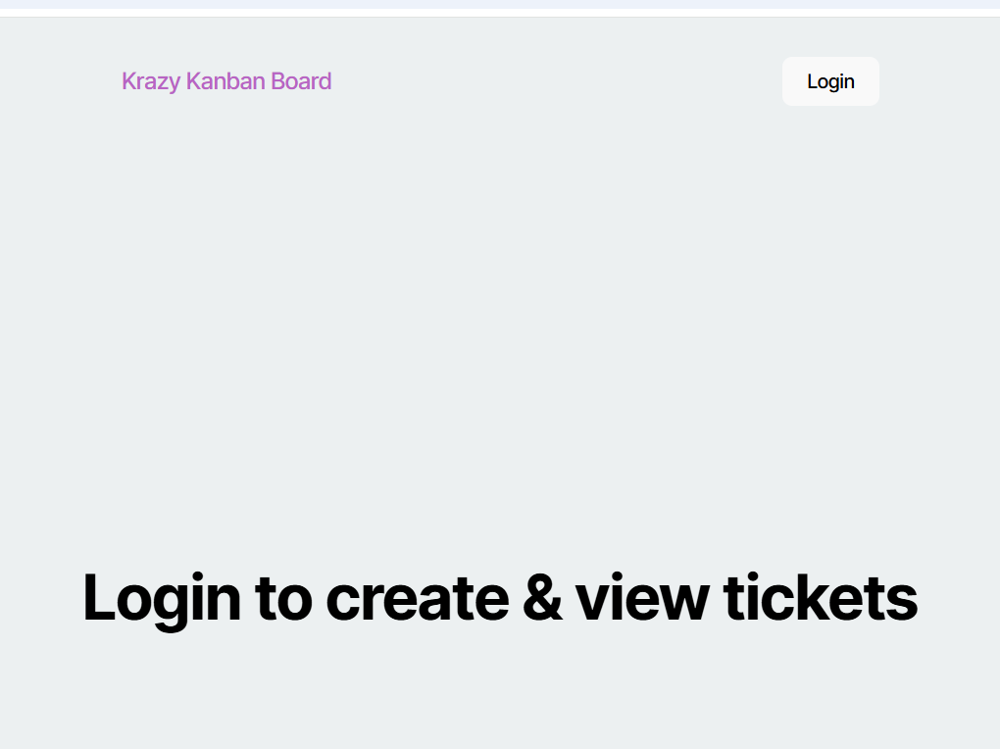
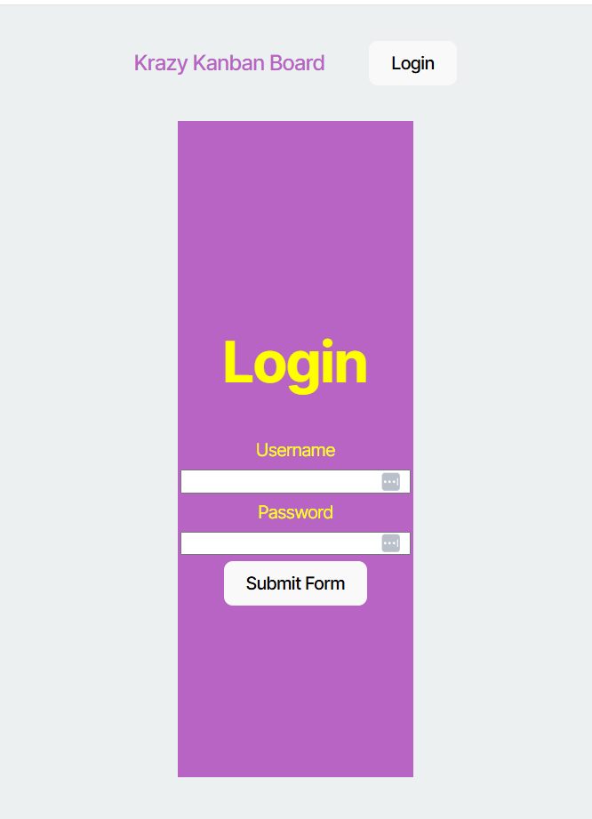
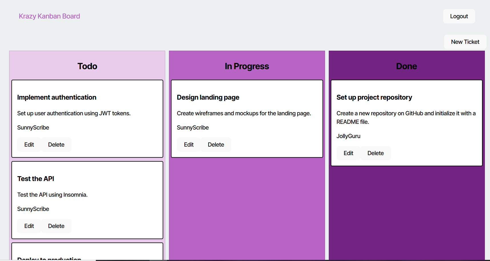
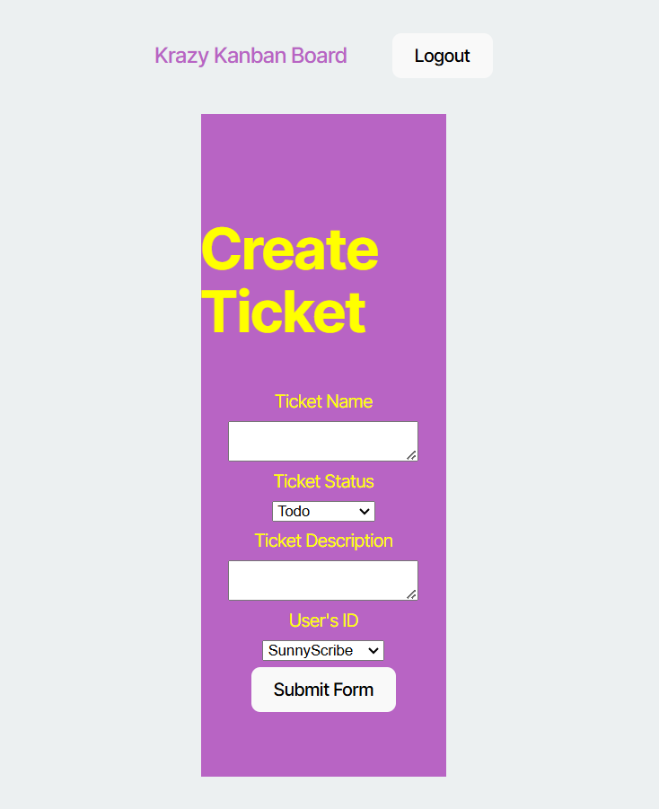
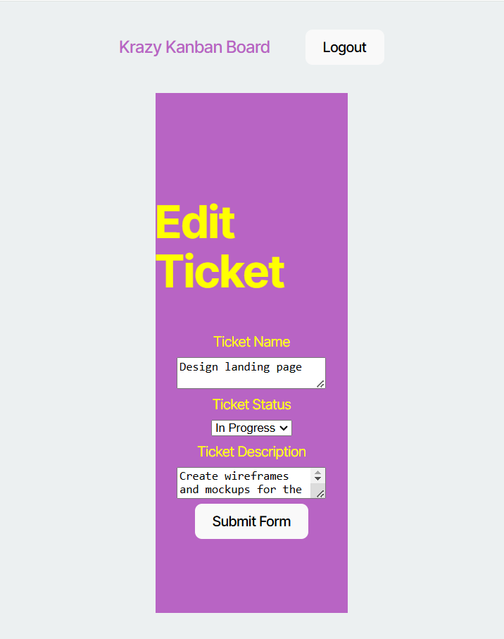

# Boardkanban
## Description 
- This App is called KanBan Board to Generate Tickets In `ToDo`, In `Progress` and In `Compelete` List.
- SO That The User can Create Different `TODO` list and keep record of the tickets created for each job/work in-progress or completed after Succesfully logged-IN.
- User Can Edit Those Created Tickets and Change the UserID (who's gona do the task) and other info pertaining to the task i.e (in-progress or Completed).
- User Can delete the task created.
- Here is the link for the APP Deployed on Render : `https://boardkanban.onrender.com/`
## Usage
- AS User Browse the link given,then The page given below will be presented:
  
- Use the Following Credentials to login into the App as:
Username:`JollyGuru` Password:`password`.

  

- Once Logged In you gona be presented With the following page:

  

- As User gona click the new ticket then User would be presented with form related to the ticket Creation as below:

- Then User can see the ticket added into the KanBan Board.
- User can edit the ticket by clicking the edit button and change the info for the same Ticket whether it is completed or in-Progress.

- User can delete the ticket by clicking the delete button for each ticket respectively.
- once clicked the logout button the User would be logged out of the app.
## Technology 
- `Techologies Used:`
   - `React/Typscript/JS/HTML/CSS` (Client Side)
   - `Express.js` (Server Side)
   - `PostgreSQL`(DataBase)
   - `JsonWebToken` (liberary) Authentications for User
   - `Bcrypt` (liberary) Hashed Password for Password Security
## License
- 
- 
- 
- 
- 

## Questions 
- 
- 

